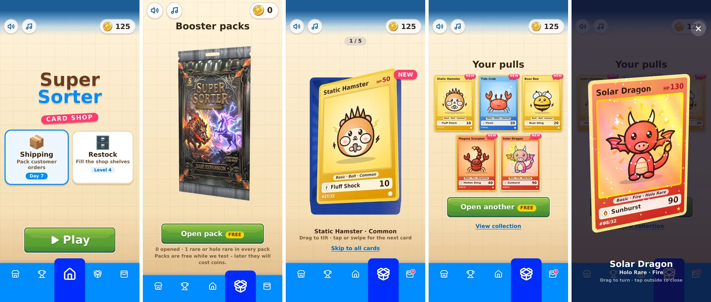

# Super Sorter

Spielbarer Prototyp eines Mobile-Puzzle-Games in einem **Card Shop** (Sammelkarten-Laden). Das Spiel ist komplett auf **Englisch**. Zwei Puzzle-Modi plus Booster-Packs zum Sammeln:

- **Shipping („Packband“) – Waren verkaufen** (Standard): Kundenpakete laufen auf einem Band vorbei und verlangen konkrete Waren. Ein Tap auf eine Lagerkiste nimmt die oberste Ware: Passt sie, fliegt sie ins Paket, sonst auf den Packtisch. Volle Pakete werden verschickt, und Waren vom Packtisch springen automatisch ins nächste Paket – Kettenreaktionen geben Kombo-Münzen. → [docs/PACK_MODE.md](docs/PACK_MODE.md)
- **Restock („Regal“) – Waren in den Bestand aufnehmen:** Du räumst die Lieferung sortenrein ins Ladenregal (Prinzip *Water Sort / Magic Sort*). → [docs/GAME_DESIGN.md](docs/GAME_DESIGN.md)

- **Packs & Collection:** Booster-Packs öffnen (5 Karten, je eine Rare oder **Holo Rare**) und das 32-Karten-Set „Base Set“ sammeln – Fantasy-Kartendesigns mit Holo-Effekt im Yu-Gi-Oh-Stil. Zum Testen sind Packs kostenlos, später kosten sie Münzen.

Waren im Laden: Booster-Packs (Fire, Water, Leaf, Bolt), Deckbox, Kartenhüllen, W20 und Sammelfigur. Beide Puzzle-Modi haben verpackte Mystery-Waren, goldene Bonus-Waren und Power-ups und teilen sich die Münzen. Die App startet im **Hauptmenü** mit unterer Menüleiste (Shop, Ranking, Home mit „Play“, Packs, Collection). Dort sind die Modi zum Testen getrennt wählbar; später sollen sie sich abwechseln. Die Web-App ist für das iPhone optimiert und läuft als Homescreen-App im Vollbild und offline.



<details>
<summary>Packband-Modus (noch mit Supermarkt-Waren)</summary>


</details>

<details>
<summary>Regal-Modus</summary>


</details>

## Features

- **Fantasy-Oberfläche passend zu Karten und Packs:** dunkler Schiefer mit Maserung und warmem Licht von oben, Gold und Bronze für Rahmen und Schrift, Glut-Orange als Akzent (wie die Edelsteine auf Kartenrückseite und Pack). Titel, Knöpfe und Zahlen in *Cinzel* (offline gebündelt). Knöpfe, Plaketten und Win-/Lose-Fenster sind reines CSS (Goldrahmen, Glut-Edelsteine in den Ecken, facettierte Goldsterne).
- **Hauptmenü:** Kartenfächer aus drei Holo Rares über dem Titel (nur auf hohen Displays), Modus-Karten als Metallplatten mit Medaillon. Untere Menüleiste nach Vektor-Vorlage (Shop, Ranking, Home, Packs, Collection als Lucide-Icons): Der Reiter (Bronzeplatte mit Goldkante und Glut hinter dem Icon) gleitet mit Überschwingen zum gewählten Icon und ploppt auf, das aktive Icon wird groß; über „Home“ sitzt der Play-Knopf. Shop und Ranking sind Platzhalter. Oben links Sound und Musik an/aus.
- **Booster-Packs in 3D (three.js):** Metallisch glänzendes Pack (KI-hochskalierte Grafik, Rahmen und Goldschrift spiegeln, gerillte Silbernähte mit Aufhängeloch). Es schwebt und lässt sich kippen; zum Öffnen quer über die Oberkante wischen: Der Riss folgt dem Finger, der Streifen rollt sich ab (gezackte Risskante mit Folienfasern, Knistern, das Pack zittert unter Zug) und fliegt davon. Die Karten steigen verdeckt heraus, jede wird per Tipp umgedreht, lässt sich mit dem Finger kippen (Glanz und Holo-Folie wandern mit) und wird weggewischt. Die Rare kommt zuletzt und glüht vorher (Holo in Regenbogenfarben), beim Aufdecken Strahlen, Banner und Konfetti. Danach Übersicht mit „NEW“-Markierungen. Ohne WebGL gibt es eine CSS-Variante.
- **Collection:** Album mit allen 32 Karten (fehlende als nummerierte Lücke), Filter nach Element, Fortschrittsbalken, Anzahl doppelter Karten, Großansicht in 3D: Karte frei drehen und kippen. Neue Karten zeigt eine Zahl am Reiter.
- **Karten:** 32 Fantasy-Kartendesigns (fertige Bilder mit Rahmen, Name und Nummer) und passende Rückseite. Holo Rares mit eigener Holo-Maske: Prismenfolie mit Regenbogen, feinem Linienraster, wanderndem Reflexionsband und Glitzer – stark, wo die Maske weiß ist. Im Raster kleine Vorschaubilder (spart Speicher).
- **Sound & Musik:** eigene, per Klangsynthese erzeugte Sounds im Stil von Sammelkarten-Spielen (Karten-„Fwip“, Folie reißt, Glitzer-Glocken für Rares) und Hintergrundmusik in Dauerschleife (wird bei Fanfaren kurz leiser). Getrennte Schalter oben links; auf iOS ab dem ersten Tap, im Lautlos-Modus des iPhones bleibt es still.
- **Packband:** Ein Tap pro Zug, alle wartenden Pakete sichtbar, Versand-Animation (Klappen, Klebeband, Abflug), Pakete fahren vom Band heran, Kettenreaktionen werden Schritt für Schritt abgespielt („Kombo ×2!“).
- **Regal-Steuerung:** Ware antippen (hebt sich an, leuchtet), dann Fach antippen (Ware hüpft im Bogen hinein). Ungültige Ziele wackeln. **Multi-Move** für gleiche sichtbare Waren.
- **Mystery-Layering:** Nur die oberste Ware je Stapel ist sichtbar. Darunter liegt Packpapier, das beim Freilegen mit Papierfetzen aufreißt. **Gold-Pakete** bringen Bonus-Münzen.
- **Gelöste Fächer** (Regal) leuchten, sprühen Sterne, zeigen ein Schloss und öffnen das nächste geschlossene Fach.
- **Je 20 handkonfigurierte Level/Tage + Endlosmodus**, seed-basiert generiert und per **Solver garantiert lösbar**. Die Schwierigkeitskurve wird über simulierte Spieler gesteuert. Alle 4 Level ein Belohnungslevel.
- **Power-ups:** Undo (mehrstufig), Extra slot, Peek, Shuffle (bleibt garantiert lösbar), jeweils mit Kontingent pro Level. Ist es aufgebraucht, kann man das Power-up für Münzen nachkaufen.
- **Win-/Lose-Screens** mit Sternen, Münzen, Konfetti; Lose-Screen mit Extra-Platz, Rückgängig, Nochmal.
- **Fortschritt** (Level je Modus, gemeinsame Münzen, Kartensammlung, Sound an/aus) in `localStorage`.
- **PWA:** Homescreen-Icon, randloses Vollbild (Inhalt bis unter Statusleiste und Home-Indikator), Safe Areas, offline spielbar, kein Zoom, kein Scroll-Bounce, keine Textmarkierung.
- **Debug-Modus** `?debug=1`: Level-Sprung, Live-Lösbarkeit, Solver-Hinweis, Auto-Lösen, Röntgenblick.

## Quickstart

Voraussetzung: Node.js ≥ 20.19 (empfohlen: aktuelle LTS).

```bash
npm install
npm run dev        # Dev-Server: http://localhost:5173 (auch im LAN erreichbar)
npm test           # Unit-Tests (Vitest): Regeln, Kettenreaktion, Reveal, Solver, Generator, Reducer
npm run build      # Typecheck + Production-Build nach dist/ (Basis-Pfad /SuperSorter/)
npm run preview    # Build lokal ansehen: http://localhost:4173/SuperSorter/
```

Weitere Scripts:

| Script | Zweck |
|---|---|
| `npm run levels:report` | Regal-Modus: Tabelle aller Level (Lösbarkeit, simulierte Gewinnquote, Generierungszeit) |
| `npm run pack:report` | Packband-Modus: dasselbe für alle Versand-Tage |
| `npm run assets` | Assets aus `assets-src/` optimieren und App-Icons erzeugen (`assets:optimize`, `assets:icons`) |
| `node scripts/cardshop-art.mjs` | Card-Shop-Waren (SVG im Code) neu nach `public/assets/items/` rendern |
| `python3 scripts/cards-import.py ordner/` | Kartenbilder + Holo-Masken übernehmen → `public/assets/cards/` (Karte, Vorschau, Alpha-Maske), Originale nach `assets-src/cards/` |
| `python3 scripts/card-design.py rahmen.png rückseite.png` | Kartenrahmen + Kartenrückseite (KI-hochskaliert) ausschneiden → `public/assets/card-design/` |
| `python3 scripts/pack-texture.py bild.png` | Booster-Pack-Textur + Materialkarte aus der (KI-hochskalierten) Pack-Grafik bauen → `public/assets/pack/` (s. docs/ASSETS.md) |
| `python3 scripts/ui-texture.py` | Maserungs-Kachel für den Hintergrund neu erzeugen → `public/assets/ui/stone.webp` |
| `python3 scripts/sfx/synth.py` | alle Sounds neu erzeugen (Klangsynthese → `public/assets/sfx/*.mp3`; braucht numpy, scipy, ffmpeg) |
| `npm run phone` | Production-Build bauen und im Netz bereitstellen (Port 4173) – zum Testen auf dem Handy |
| `npm run typecheck` | nur TypeScript prüfen |
| `npm run test:watch` | Tests im Watch-Modus |

## Auf dem iPhone testen (GitHub Pages)

Der Service Worker und die Homescreen-App brauchen HTTPS. Deshalb wird über GitHub Pages veröffentlicht.

**Einmalig einrichten**

1. Auf GitHub im Repo: **Settings → Pages → Build and deployment → Source: „GitHub Actions“** auswählen.
2. Den Entwicklungsbranch nach `main` mergen. Der Workflow [`.github/workflows/deploy.yml`](.github/workflows/deploy.yml) startet bei jedem Push auf `main` automatisch (Tests → Build → Deploy). Alternativ: **Actions → „Deploy to GitHub Pages“ → „Run workflow“** auf `main`.
3. Im Tab **Actions** warten, bis beide Jobs grün sind (ca. 1–2 Minuten). Die URL steht im Job „deploy“:
   **https://achimbenzel.github.io/SuperSorter/**

**Auf den Homescreen legen**

4. Die URL auf dem iPhone in **Safari** öffnen (nicht in Chrome/In-App-Browsern).
5. Unten auf **Teilen** (Quadrat mit Pfeil) → **„Zum Home-Bildschirm“** → Name „Super Sorter“ → **Hinzufügen**.
6. Die App vom Homescreen starten. Sie läuft im Vollbild ohne Safari-Leisten, im Hochformat und nach dem ersten Start auch offline.

**Nach einem Update**

- Neue Versionen lädt der Service Worker im Hintergrund und aktiviert sie automatisch. Normalerweise reicht es, die App zu öffnen, ein paar Sekunden zu warten und sie dann einmal zu schließen (im App-Umschalter nach oben wischen) und neu zu starten.
- Zeigt die App weiterhin die alte Version: App-Icon lange drücken → **App entfernen**, optional in den iOS-Einstellungen unter Safari → Erweitert → Websitedaten die Daten von `github.io` löschen, und dann Schritt 4–5 wiederholen.
- Achtung: Homescreen-Apps haben auf iOS einen eigenen Speicher. Beim Entfernen der App geht der Spielstand (Level, Münzen) verloren.

**Schneller Test ohne Deployment (im WLAN):** `npm run phone` auf dem Rechner starten (Production-Build + Vorschau) und auf dem iPhone `http://<IP-des-Rechners>:4173/SuperSorter/` öffnen (die IP zeigt Vite als „Network“ an). Service Worker und Offline-Modus laufen ohne HTTPS nicht, das Gameplay schon.

> **Dev-Server (`npm run dev`, Port 5173) nicht zum Beurteilen von Tempo nutzen.** Er liefert React im Entwicklungsmodus (deutlich langsamer, Komponenten werden doppelt gerendert), lädt hunderte einzelne Module und hat keinen Service Worker. Ruckler und fehlende Bilder über WLAN sind dort normal und kein Fehler der App. Bilder unter `/assets/` werden im Dev-Server seit diesem Update eine Stunde gecacht; nach dem Austauschen von Assets einmal ohne Cache neu laden. Der Dev-Server ist für schnelles Ausprobieren von Änderungen (Hot Reload) gedacht.

### Test über Tailscale (empfohlen für lokales Testen)

`tailscale serve` stellt den lokalen Server per **HTTPS mit gültigem Zertifikat** im Tailnet bereit. Die Windows-Firewall spielt dabei keine Rolle, weil Tailscale selbst die Verbindung annimmt und an `localhost` weiterreicht.

Einmalig: In der Tailscale-Admin-Konsole unter **DNS** „MagicDNS“ und „HTTPS Certificates“ aktivieren. Auf dem iPhone muss die Tailscale-App verbunden sein.

```powershell
# Terminal 1: Dev-Server
npm run dev

# Terminal 2: per HTTPS ins Tailnet freigeben (läuft im Hintergrund weiter)
tailscale serve --bg 5173
# -> zeigt https://<pc-name>.<tailnet>.ts.net an, diese URL auf dem iPhone öffnen

tailscale serve reset   # Freigabe später wieder beenden
```

Für den **vollständigen PWA-Test** (Homescreen, Service Worker, offline – und realistisches Tempo) den Production-Build freigeben:

```powershell
npm run phone            # = npm run build + npm run preview, Port 4173
tailscale serve --bg 4173
# -> https://<pc-name>.<tailnet>.ts.net/SuperSorter/ öffnen, dann Teilen -> Zum Home-Bildschirm
```

`*.ts.net`-Hostnamen sind in `vite.config.ts` (`allowedHosts`) freigeschaltet; andere Hostnamen blockt Vite mit „Blocked request“.

**Direkt über die Tailscale-IP (`http://100.x.y.z:5173`) lädt nichts?** Meist blockt die Windows-Firewall. Typische Ursache: Beim ersten Start von Node.js hat Windows gefragt, und dabei wurde nur „Private Netzwerke“ erlaubt. Windows legt dann für öffentliche Netzwerke eine **Block-Regel für node.exe** an, und Block-Regeln haben Vorrang vor jeder Allow-Regel für den Port. Das Tailscale-Netz zählt unter Windows oft als „öffentlich“. Lösung (PowerShell als Administrator):

```powershell
Get-NetConnectionProfile                                    # Ist "Tailscale" Public?
Set-NetConnectionProfile -InterfaceAlias "Tailscale" -NetworkCategory Private
# oder die Block-Regeln für Node.js abschalten:
Get-NetFirewallRule | Where-Object { $_.DisplayName -like "*Node*" -and $_.Action -eq "Block" } | Disable-NetFirewallRule
```

**Debug-Modus:** URL mit `?debug=1` öffnen, z. B. `https://achimbenzel.github.io/SuperSorter/?debug=1`. Das Panel lässt sich über ✕ einklappen und über 🐞 wieder öffnen.

## Ordnerübersicht

```
SuperSorter/
├─ .github/workflows/deploy.yml   GitHub Pages: Tests, Build, Deploy
├─ assets-src/                    Original-PNGs (unverändert, Quelle für Scripts)
├─ docs/
│  ├─ ARCHITECTURE.md             Aufbau, Datenfluss, Zustandsmodell, Solver/Generator, Erweitern
│  ├─ GAME_DESIGN.md              Regeln, Mystery, Booster, Progression, Annahmen
│  ├─ PACK_MODE.md                Packband-Modus: Regeln, Kettenreaktion, Tage, Playtest-Erkenntnisse
│  ├─ ASSETS.md                   Asset-Zuordnung, Größen, Platzhalter
│  ├─ ROADMAP.md                  nächste Schritte
│  └─ screenshots/
├─ public/assets/                 optimierte Assets (WebP) + App-Icons
│  ├─ items/  mystery/  board/  ui/  icons/
│  ├─ cards/                      Kartenbilder NN.webp, Vorschauen thumbs/, Holo-Masken NN-holo.webp
│  ├─ pack/                       Booster-Pack: Grafik + Materialkarte (aus scripts/pack-texture.py)
│  ├─ card-design/                Kartenrahmen + Rückseite (Prototyp, aus scripts/card-design.py)
│  ├─ music/  sfx/                Hintergrundmusik, Sounds
├─ scripts/
│  ├─ asset-map.mjs               Zuordnung Original → Ziel
│  ├─ cardshop-art.mjs            Card-Shop-Waren als SVG → WebP
│  ├─ cards-import.py             Kartenbilder + Holo-Masken übernehmen
│  ├─ pack-texture.py             Booster-Pack-Textur + Materialkarte
│  ├─ card-design.py              Kartenrahmen + Rückseite ausschneiden
│  ├─ ui-texture.py               Maserungs-Kachel des Hintergrunds (stone.webp)
│  ├─ optimize-assets.mjs         npm run assets:optimize (sharp)
│  ├─ generate-icons.mjs          npm run assets:icons (180/192/512/maskable)
│  ├─ level-report.ts             npm run levels:report
│  ├─ pack-report.ts              npm run pack:report
│  └─ sfx/synth.py                Sound-Design als Code (alle Sounds)
├─ src/
│  ├─ game/                       reine Spiellogik + Tests, Regal-Modus (types, rules, reducer, solver, generator, levels)
│  │  ├─ sources.ts               gemeinsame Karton-Regeln beider Modi
│  │  ├─ pack/                    Packband-Modus (types, rules, reducer, solver, generator, levels, customers + Tests)
│  │  └─ cards/                   Kartenset (32 Karten), Booster-Packs, Sammlung + Tests
│  ├─ modes/                      PackGame, ShelfGame (je ein kompletter Spielbildschirm)
│  ├─ components/                 Board, Shelf, ShelfSlot, DeliveryBox, Stack, Item, Cart,
│  │  │                           BoosterBar, HUD, WinScreen, LoseScreen, DebugPanel, …
│  │  ├─ home/                    HomeScreen, TabBar, PacksPage (Pack öffnen), CollectionPage (Album)
│  │  ├─ three/                   Packs3D, CardViewer3D (React-Seite der 3D-Ansichten)
│  │  ├─ cards/                   TcgCard (Kartenbild, Holo ohne WebGL), BoosterPack
│  │  └─ pack/                    PackBoard, PackBox, plan (Animationsplan), timeline (Zeitplan der Kette)
│  ├─ hooks/                      useGame, usePackGame, progress, usePersistedState, useFlip, useFxAnimations, …
│  ├─ three/                      3D mit three.js: PackOpening, CardViewer, Holo-Shader, Karten-/Pack-Modelle
│  ├─ audio/                      sfx.ts (Sound-Schnittstelle), player.ts (Web Audio, an/aus), music.ts (Musik)
│  ├─ styles/                     tokens.css (Design-Tokens), global.css, game.css, screens.css, pack.css, home.css, cards.css
│  ├─ assets.ts                   zentrales Asset-Mapping (einzige Stelle mit Bildpfaden)
│  ├─ imageLoader.ts              Bilder vorladen/dekodieren/festhalten, Ladefehler wiederholen
│  ├─ levelStore.ts, levelWorker.ts  Level-Cache beider Modi, Vorberechnung im Web Worker
│  ├─ config.ts                   UI-Zeiten, Storage-Key, Debug-Flag
│  ├─ iosGuards.ts                Schutz vor Zoom/Bounce/Long-Press
│  ├─ viewport.ts                 Höhe der Homescreen-App (--app-h), Seitenfarbe unten, Diagnose
│  ├─ App.tsx, main.tsx
├─ index.html                     iOS-Meta-Tags, Apple-Touch-Icon
├─ vite.config.ts                 Basis-Pfad, PWA/Manifest/Service Worker
├─ vitest.config.ts, tsconfig.json, package.json
```

## Tech-Stack und Entscheidungen

| | |
|---|---|
| React 18 + Vite 8 + TypeScript 5.9 (strict) | TS 5.9 statt 7.x: erprobt mit allen Tools |
| Zustand per **`useReducer`** | Ein einziges Zustandsobjekt; der Reducer ist eine reine Funktion und ohne React testbar. Eine Bibliothek wie Zustand bringt hier keinen Mehrwert. |
| Animationen per **CSS + Web Animations API** | Nur `transform`/`opacity`, kein framer-motion nötig (kleineres Bundle, volle Kontrolle) |
| `canvas-confetti` | Funken (Gold/Glut) im Win-Screen und bei Rares |
| `@fontsource/cinzel` | Titelschrift (nur Latin, 700 + 900), gebündelt und offline gecacht |
| `vite-plugin-pwa` (Workbox) | Manifest + Service Worker |
| Vitest | Unit-Tests der Spiellogik |
| sharp (dev) | Asset-Optimierung und Icon-Generierung |

## Dokumentation

- [docs/PACK_MODE.md](docs/PACK_MODE.md): Packband-Modus – Regeln, Kettenreaktion, Tage, was aus dem Onlineshop-Playtest gelernt wurde
- [docs/GAME_DESIGN.md](docs/GAME_DESIGN.md): Regal-Modus – Regeln, Booster, Level-Tabelle, **getroffene Annahmen**
- [docs/ARCHITECTURE.md](docs/ARCHITECTURE.md): Code-Aufbau, Solver, Generator, Animationen, Kochrezepte zum Erweitern
- [docs/ASSETS.md](docs/ASSETS.md): welches Bild wofür, fehlende Assets
- [docs/ROADMAP.md](docs/ROADMAP.md): nächste Schritte (Modi abwechseln, Packs mit Münzen, Kartenkunst, Meta-Ebene)
